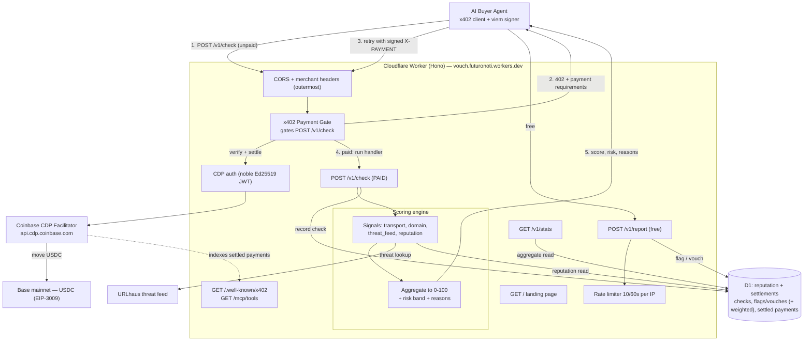
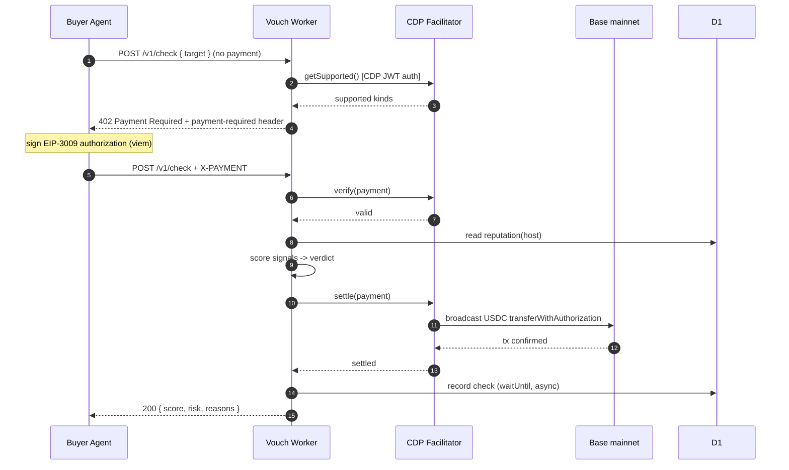
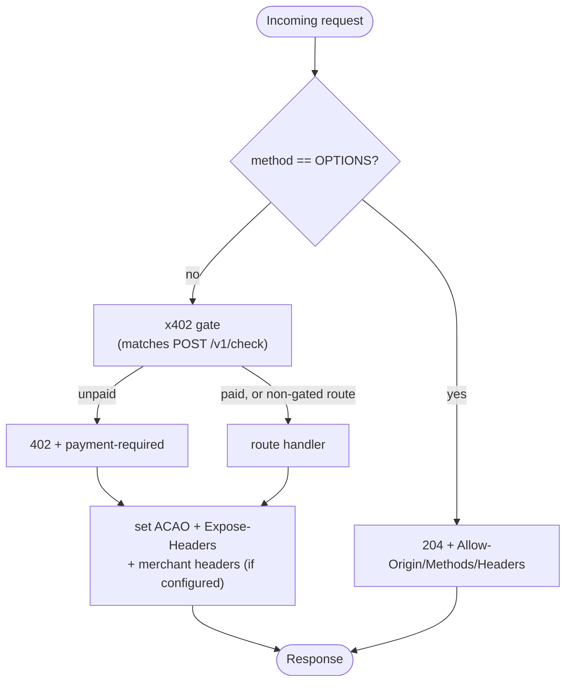
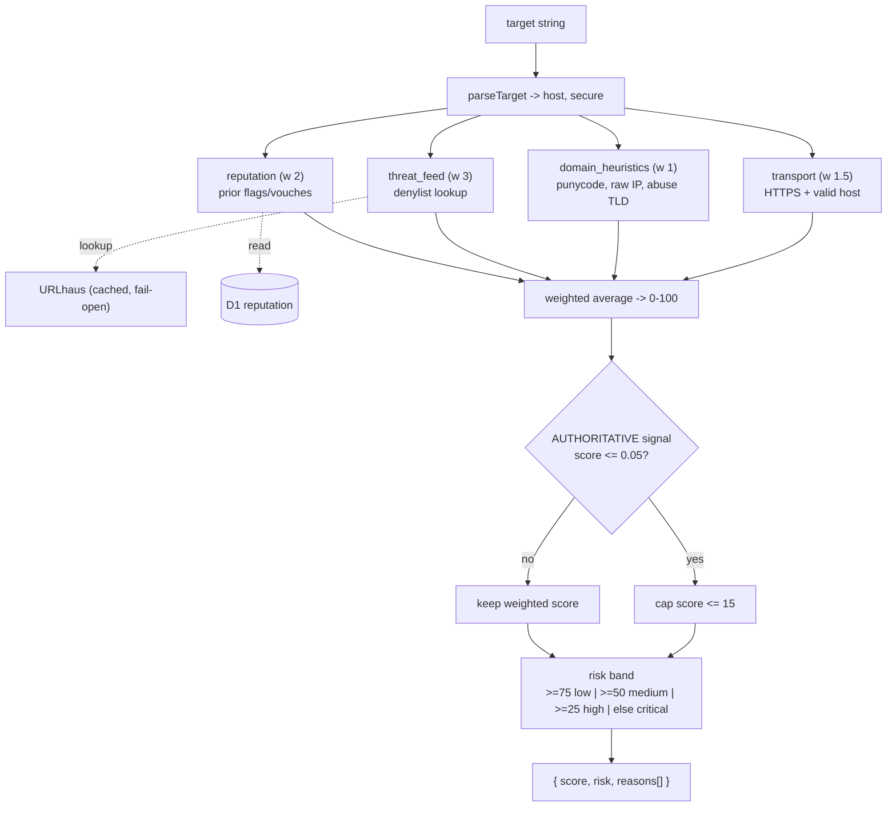
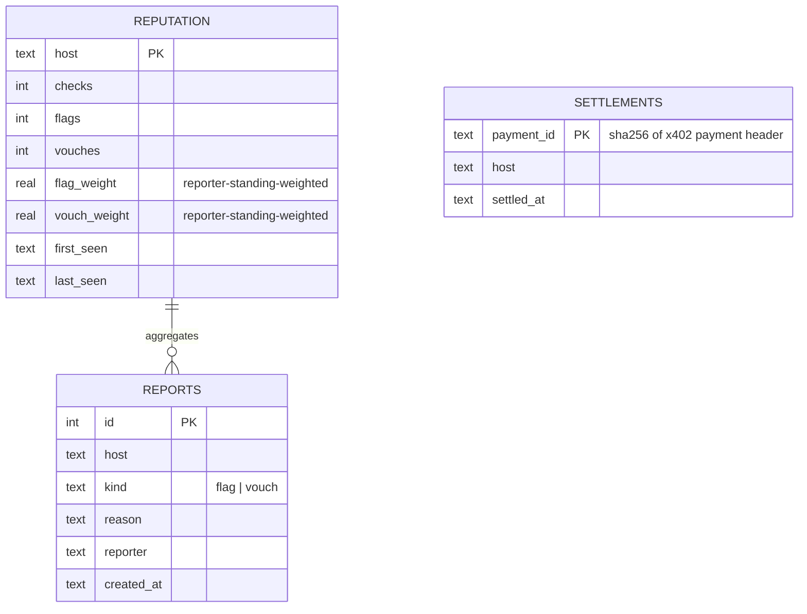
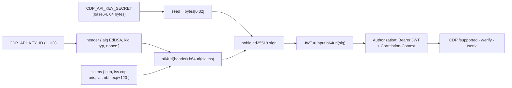
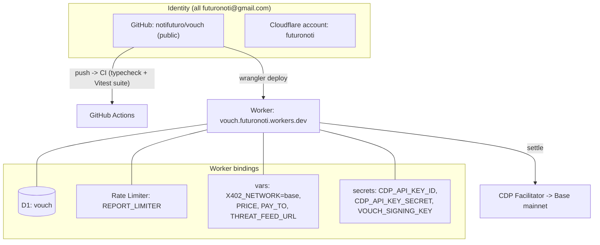
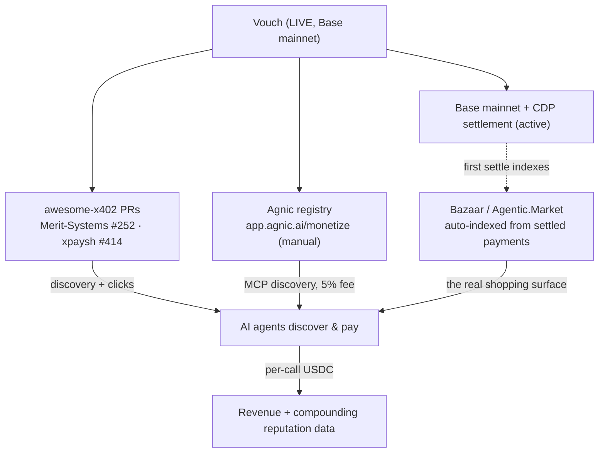
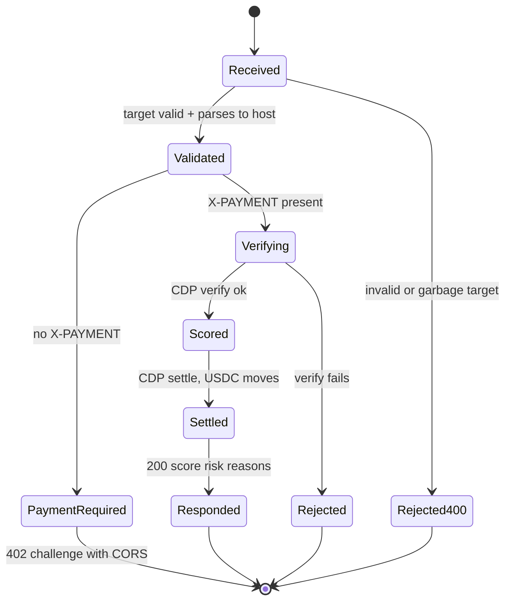

# Vouch — Architecture Diagrams

A complete set of Mermaid diagrams for Vouch, the per-call payment-trust API for
AI agents. These render on GitHub automatically, or paste any block into
[mermaid.live](https://mermaid.live) to view/export as SVG/PNG.

- [1. System architecture](#1-system-architecture)
- [2. Sequence — x402 pay/retry handshake](#2-sequence--x402-payretry-handshake)
- [3. Request middleware pipeline](#3-request-middleware-pipeline)
- [4. Scoring engine](#4-scoring-engine)
- [5. Data model (D1)](#5-data-model-d1)
- [6. CDP facilitator auth (Ed25519 JWT)](#6-cdp-facilitator-auth-ed25519-jwt)
- [7. Deployment & identity topology](#7-deployment--identity-topology)
- [8. Distribution & growth path](#8-distribution--growth-path)
- [9. /v1/check request lifecycle](#9-v1check-request-lifecycle)
- [10. Full tech stack](#10-full-tech-stack)

---

## 1. System architecture

---

## 2. Sequence — x402 pay/retry handshake

---

## 3. Request middleware pipeline

The CORS/headers middleware is **outermost** so it decorates every response —
including the gate's short-circuited `402` — and answers `OPTIONS` preflight
directly. (We use manual headers, not `hono/cors`, which hangs when wrapping the
x402-gated POST.)

---

## 4. Scoring engine

Weighted average of independent signals, with a safety override: only an
**authoritative** signal (threat feed / transport) scoring ~0 can hard-cap the
total — crowd reputation cannot, which resists report-poisoning.

---

## 5. Data model (D1)

---

## 6. CDP facilitator auth (Ed25519 JWT)

Workers-native auth: jose/WebCrypto sign invalid Ed25519 under `nodejs_compat`,
so we sign the CDP JWT with pure-JS `@noble/curves` (byte-identical to standard).

---

## 7. Deployment & identity topology

---

## 8. Distribution & growth path

---

## 9. /v1/check request lifecycle

---

## 10. Full tech stack

Runtime, code modules, dependencies, protocols, external services, and dev/build —
everything, in one view.

```mermaid
flowchart TB
    subgraph CLIENTS["AI agents (clients)"]
      AG1["x402 buyer agent<br/>@x402/fetch + viem signer"]
      AG2["MCP clients<br/>Claude / Cline / frameworks"]
    end

    subgraph EDGE["Cloudflare Workers — edge runtime"]
      direction TB
      subgraph APP["Hono app · TypeScript · src/index.ts"]
        MW["middleware:<br/>CORS + merchant hdrs · x402 gate"]
        ROUTES["routes: /v1/check (paid) · /v1/score (free) ·<br/>/v1/report · /mcp · /.well-known/x402 ·<br/>/mcp/tools · /v1/attestation/pubkey · /v1/stats · /health · /"]
      end
      subgraph LOGIC["core modules (src/)"]
        SCORE["scoring/: assess · engine · signals<br/>(transport, domain, threat_feed, reputation)"]
        PAY["payments.ts: x402 gate + Bazaar extension"]
        CDPA["cdpAuth.ts: CDP JWT (Ed25519)"]
        ATT["attest.ts: signed attestation (Ed25519)"]
        MCPS["mcp.ts: JSON-RPC tools"]
        DISC["discovery.ts: descriptors + schemas"]
        DB["db/: repo · denylist · schema.sql"]
        RL["ratelimit.ts · landing.ts · types.ts"]
      end
      subgraph BIND["Worker bindings"]
        D1[("D1 SQLite:<br/>reputation, reports, settlements")]
        RLB["Rate limiters:<br/>REPORT, SCORE"]
        SEC["Secrets: CDP_API_KEY_ID/SECRET,<br/>VOUCH_SIGNING_KEY"]
        VARS["Vars: X402_NETWORK=base,<br/>PRICE, PAY_TO, THREAT_FEED_URL"]
      end
    end

    subgraph DEPS["npm dependencies"]
      DX["@x402/core · /hono · /evm · /extensions · /fetch"]
      DN["@noble/curves (ed25519)"]
      DH["hono"]
      DV["viem"]
    end

    subgraph STD["protocols & standards"]
      P1["x402 (HTTP 402)"]
      P2["MCP — Streamable HTTP, JSON-RPC 2.0"]
      P3["EIP-3009 transferWithAuthorization"]
      P4["Ed25519 / EdDSA JWT"]
      P5["USDC · CAIP-2 networks"]
    end

    subgraph EXT["external services"]
      CDP["Coinbase CDP facilitator"]
      CHAIN["Base mainnet (eip155:8453) · USDC"]
      FEED["URLhaus threat feed"]
      REG["MCP registry → PulseMCP / Glama"]
      BZR["x402 Bazaar → Agentic.Market<br/>+ AWS Bedrock AgentCore"]
    end

    subgraph DEV["dev · build · CI · dist"]
      TS["TypeScript (strict)"]
      VIT["Vitest test suite"]
      WR["Wrangler (deploy)"]
      WT["@cloudflare/workers-types"]
      GH["GitHub notifuturo/vouch + Actions CI"]
      PUB["mcp-publisher"]
      SDK["vouch-sdk (zero-dep npm pkg)"]
      RUFLO["dev env: ruflo / agentic-flow"]
    end

    AG1 -->|"402 → pay → retry"| MW
    AG2 -->|"JSON-RPC"| ROUTES
    MW --> ROUTES
    ROUTES --> SCORE & PAY & ATT & MCPS & DISC
    SCORE --> DB
    MCPS --> SCORE
    PAY --> CDPA --> CDP --> CHAIN
    SCORE --> FEED
    DB --- D1
    RL --- RLB
    CDPA & ATT --- SEC
    PAY --- VARS

    APP --- DH
    PAY --- DX
    CDPA & ATT --- DN
    AG1 --- DV

    PAY -. implements .-> P1 & P3 & P5
    MCPS -. implements .-> P2
    CDPA & ATT -. use .-> P4

    WR -->|deploy| EDGE
    GH --> VIT & WR & PUB
    PUB --> REG
    CHAIN -. first settle indexes .-> BZR
    SDK -. wraps .-> ROUTES
```

**Stack at a glance:** TypeScript (strict) · Hono · Cloudflare Workers (D1, Rate
Limiting, Secrets/Vars) · deps `@x402/core` `/hono` `/evm` `/extensions` `/fetch`,
`@noble/curves`, `hono`, `viem` · standards x402, MCP, EIP-3009, Ed25519/EdDSA,
USDC, CAIP-2 · external CDP facilitator → Base mainnet, URLhaus, MCP registry
(→ PulseMCP/Glama), x402 Bazaar → Agentic.Market + AWS Bedrock · dev/build Vitest,
Wrangler, GitHub Actions CI, `mcp-publisher`, `vouch-sdk`.
